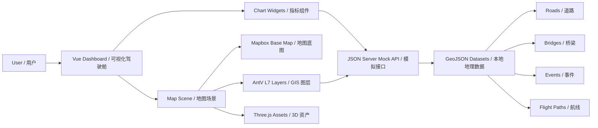

# NCWU SmartCity Wuhan | 华水智慧武汉可视化平台

A public portfolio edition of a Wuhan smart-city GIS visualization prototype built with Vue 3, Vite, GeoJSON, AntV L7/G2Plot, Mapbox GL, Turf, Three.js, and a JSON Server mock API.

本仓库是“智慧武汉”GIS 可视化项目的公开展示版，基于 Vue 3、Vite、GeoJSON、AntV L7/G2Plot、Mapbox GL、Turf、Three.js 与 JSON Server mock API 构建，用于展示城市运行数据、交通事件、桥梁资产、航线流向与三维场景素材的整合思路。

> Note: heavy local exports and private tokens are intentionally excluded from Git. See [Data Policy](#data-policy--数据说明).
>
> 说明：大型本地数据快照和私有 token 已从 Git 提交范围中排除，详见 [Data Policy](#data-policy--数据说明)。

## Highlights | 项目亮点

- GIS-oriented city dashboard: local Wuhan GeoJSON datasets are organized around roads, bridge lines, traffic/events, flight paths, and destinations.
- Layered visualization architecture: map base layer, city feature layers, business event overlays, chart widgets, and 3D model assets are separated conceptually.
- Mock-first workflow: JSON Server serves local datasets as API-like resources, making front-end development independent from a production backend.
- Portfolio-ready cleanup: dependency folders, environment secrets, database snapshots, and oversized GeoJSON files are ignored for a clean public repository.

- 面向 GIS 的城市运行看板：围绕武汉道路、桥梁、事件点、航线与目的地等 GeoJSON 数据组织页面展示。
- 分层可视化架构：底图、城市要素图层、业务事件叠加层、图表组件与 3D 模型资产在设计上相互解耦。
- Mock 优先的开发模式：使用 JSON Server 将本地数据模拟为接口资源，前端可在后端未完成时独立联调。
- 公开仓库整理：排除依赖目录、环境密钥、数据库快照和超大 GeoJSON，适合作为项目经历展示。

## Tech Stack | 技术栈

| Layer | English | 中文 |
| --- | --- | --- |
| Frontend | Vue 3 + Vite | Vue 3 单页应用与 Vite 构建 |
| UI | Element Plus | 后台/中台式 UI 组件 |
| Map & GIS | Mapbox GL, AntV L7, Turf.js | 地图底图、地理图层渲染、空间分析 |
| Charts | AntV G2 / G2Plot | 数据图表与运行指标展示 |
| 3D Assets | Three.js / GLTF / OBJ | 公交、建筑/街区模型等三维资产 |
| Mock API | JSON Server + Mock.js | 本地接口模拟与数据装配 |
| Data | GeoJSON | 武汉城市要素与业务事件数据 |

## Architecture | 系统架构



### Frontend Layer | 前端层

The application is organized as a Vue/Vite dashboard. The public edition includes a lightweight overview screen that reads local GeoJSON and presents core city-operation metrics, event levels, bridge markers, and route previews.

项目以 Vue/Vite 作为前端承载层。公开展示版补充了一个轻量首页，直接读取本地 GeoJSON，展示城市运行指标、事件等级、桥梁标记和航线预览。

### GIS Visualization Layer | GIS 可视化层

The original design separates base maps from business layers: Mapbox provides the geographic base, AntV L7 handles high-performance spatial layers, Turf supports geospatial calculation, and Three.js-compatible assets can be mounted for 3D city scenes.

原设计将底图与业务图层分离：Mapbox 负责地理底图，AntV L7 承担高性能空间图层渲染，Turf 用于空间计算，Three.js 兼容资产可接入三维城市场景。

### Data & Mock Layer | 数据与模拟接口层

`mock.js` exposes local GeoJSON through JSON Server. This keeps data access close to real API usage while allowing the team to iterate without a deployed backend service.

`mock.js` 使用 JSON Server 暴露本地 GeoJSON 数据，使前端按接口方式开发，同时不依赖已部署后端服务。

## Project Structure | 目录结构

```text
.
├── GIS_DATA/                 # Public GeoJSON samples / 可提交的 GeoJSON 示例数据
├── src/
│   ├── App.vue               # Portfolio dashboard entry / 展示页入口
│   ├── main.js               # Vue bootstrap / Vue 启动入口
│   ├── styles.css            # Dashboard styles / 页面样式
│   └── assets/               # Icons, images, map themes, 3D models / 图标、图片、地图主题、三维模型
├── mock.js                   # JSON Server mock API / 本地模拟接口
├── vite.config.js            # Vite config / 构建配置
├── .env.example              # Environment example / 环境变量示例
└── README.md
```

## Getting Started | 快速开始

```bash
npm install
npm run dev
```

Run the mock API in another terminal when API-style data access is needed:

如需模拟接口，可在另一个终端运行：

```bash
npm run mock
```

Build for production:

生产构建：

```bash
npm run build
```

## Environment | 环境变量

Create a local `.env` from `.env.example` when Mapbox-based map rendering is enabled:

如需启用 Mapbox 地图渲染，请基于 `.env.example` 创建本地 `.env`：

```bash
VITE_TOKEN=your_mapbox_public_token_here
```

Never commit real tokens. If the token is missing, expired, or unauthorized, the app keeps running with a local fallback map preview.

请勿提交真实 token。如果 token 缺失、过期或权限失效，应用会自动使用本地地图预览兜底，避免页面白屏。

## Data Policy | 数据说明

The following files are intentionally ignored:

以下文件已被刻意排除在 Git 提交范围外：

- `node_modules/`: install dependencies locally with `npm install`.
- `.env`, `.env.*`: may contain private Mapbox tokens or other local secrets.
- `db-*.json`: large JSON Server/database snapshots, about 256 MB each in the local archive.
- `GIS_DATA/Wuhan_Buildings.json`: large building GeoJSON, about 100 MB locally. Keep it outside Git or use Git LFS/releases if public distribution is required.

Small GeoJSON samples such as bridge, anonymized event, flight, destination, and road datasets are kept so the demo and mock service remain meaningful.

仓库保留桥梁、已脱敏事件、航线、目的地、道路等较小示例数据，保证展示页与 mock 服务仍然有真实数据语义。

## Design Review | 架构评价

The team made a solid choice for a smart-city visualization prototype: Vue + Vite keeps the UI lightweight, AntV L7 and Mapbox are suitable for GIS-heavy rendering, Turf leaves room for spatial analysis, and JSON Server lowers the integration cost while the backend is still evolving.

从架构上看，这套设计很适合作为智慧城市可视化原型：Vue + Vite 保持前端轻量，AntV L7 与 Mapbox 适合 GIS 图层渲染，Turf 给空间分析预留能力，JSON Server 则降低了后端尚未稳定时的联调成本。

The main improvement for a production-grade version would be to split large geospatial assets into tiled/vector services, add typed API contracts, and move event processing into a real backend pipeline. For a student/team project, the original direction is practical and technically credible.

如果走向生产级版本，主要改进方向是把大型地理数据拆成瓦片/矢量服务，补充类型化接口契约，并把事件处理迁移到真实后端流水线。作为团队课程/项目经历，这个方向是扎实且有技术含量的。


